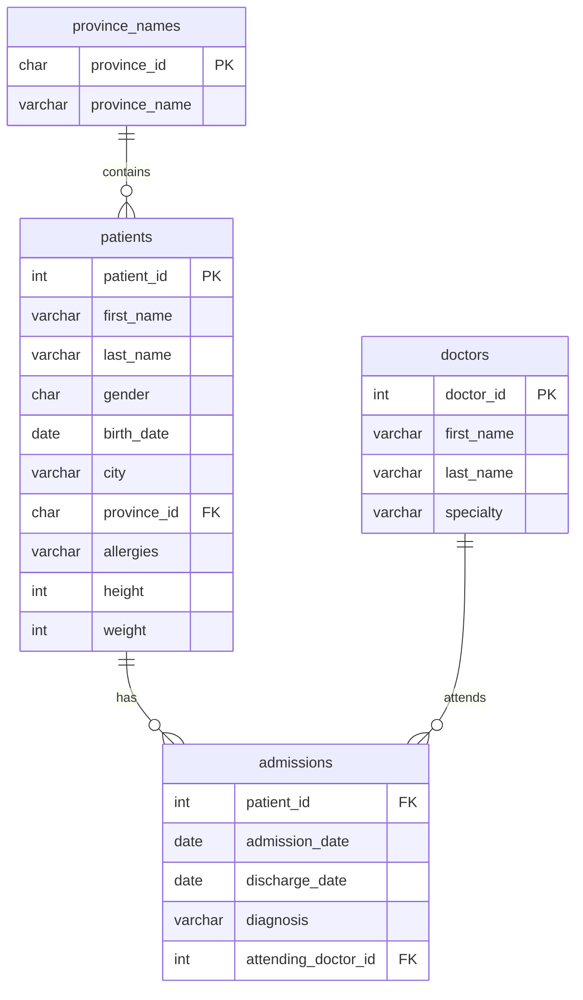

# Hospital Database Schema

```mermaid
erDiagram
    patients {
        int patient_id PK
        varchar first_name
        varchar last_name
        char gender
        date birth_date
        varchar city
        char province_id FK
        varchar allergies
        int height
        int weight
    }
    admissions {
        int patient_id FK
        date admission_date
        date discharge_date
        varchar diagnosis
        int attending_doctor_id FK
    }
    doctors {
        int doctor_id PK
        varchar first_name
        varchar last_name
        varchar specialty
    }
    province_names {
        char province_id PK
        varchar province_name
    }

    patients ||--o{ admissions : "has"
    doctors ||--o{ admissions : "attends"
    province_names ||--o{ patients : "contains"
```
